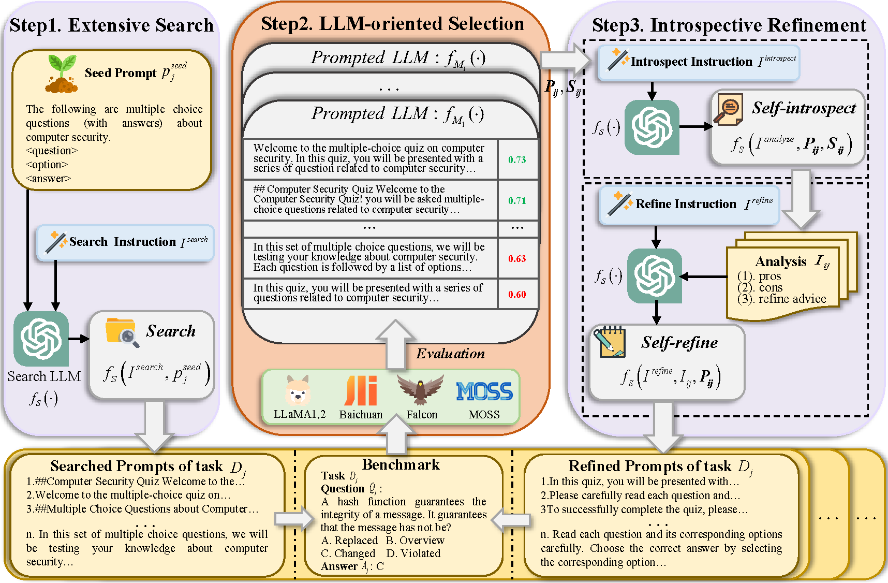

# [COLING 2024] promISe:Releasing the Capabilities of LLMs with Prompt Introspective Search
This is the official repository for this accepted paper.

## Abstract


The development of large language models (LLMs) raises the importance of assessing the fairness and completeness of various evaluation benchmarks. Regrettably, these benchmarks predominantly utilize uniform manual prompts, which may not fully capture the expansive capabilities of LLMs—potentially leading to an underestimation of their performance. To unlock the potential of LLMs, researchers pay attention to automated prompt search methods, which employ LLMs as optimizers to discover optimal prompts. However, previous methods generate the solutions implicitly, which overlook the underlying thought process and lack explicit feedback. In this paper, we propose a novel prompt introspective search framework, namely PromISe, to better release the capabilities of LLMs. It converts the process of optimizing prompts into an explicit chain of thought, through a step-by-step procedure that integrates self-introspect and self-refine. Extensive experiments, conducted over 73 tasks on two major benchmarks, demonstrate that our proposed PromISe significantly boosts the performance of 12 well-known LLMs compared to the baseline approach. Moreover, our study offers enhanced insights into the interaction between humans and LLMs, potentially serving as a foundation for future designs and implementations.

> *Please find more details of this work in our paper.*

## Installation

**Step 1.** Create a conda environment and activate it.

```shell
conda create --name promise python=3.8 -y
conda activate promise
```
**Step 2.** Install other dependencies.

```shell
pip install -r requirements.txt
```

**Step 3.**  Add configuration information to the `config.py`.

use your own openai-key and proxy (if need)

## Getting Started
```shell
# step1 extensive search
bash run_step1.sh

# step2 
bash run_step2_3.sh
```
**Note**: 
1. `extensive_search.py` and `introspective_search.py` are used to search prompt corresponding to the step 1 and step 3 of promISe.
2. `inference.py` is used to evaluate the LLM with prompts.

## Prompts
We find optimizing prompts tailored to each LLM on MMLU and AGIEval benchmarks. 

The details can be seen in `promISe\instruction`

## Citation
Please consider citing our work as follows if it is helpful.

```
@inproceedings{wang2024promise,
    title={promISe:Releasing the Capabilities of LLMs with Prompt Introspective Search}, 
    author={Wang, Minzheng and Xu, Nan and Zhao, Jiahao and Luo, Yin and Mao, Wenji},
    booktitle={LREC-COLING},
    year={2024},
}
```

## Acknowledgement
Thanks for these amazing work!
- [Chain-of-thought-hub](https://github.com/FranxYao/chain-of-thought-hub)
- [APE](https://github.com/keirp/automatic_prompt_engineer)